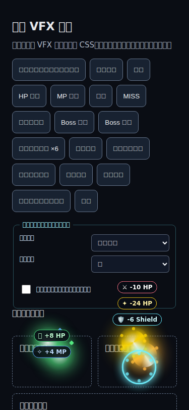

# VFX 第二輪改善：QA／過目報告

## 結論

第二輪 roadmap **#3–#9 已按批准範圍完成**。舊式 VFX 仍是預設；新增增強形狀及品質／動態設定均可選。沒有改動傷害、命中機率、hit count、回合節奏、治療狀態計算、獎勵、存檔格式或後端。

**有意調整的呈現：**投射物現在表示「施放」，不再預先使用命中特效；MISS 只顯示 MISS，不會冒充確認命中。獨立結果標籤顯示實際 HP／MP 增量；多段技能合併裝飾時，以 `×N` 保留實際 hit count。VFX 位置由隨機偏移改成固定序列，避免消耗與戰鬥共用的 `Math.random()`。因此，往後 VFX 不會因品質／風格設定改變戰鬥 RNG 消耗；但**不保證與舊版整場冒險的隨機序列相同**。

## #3–#9 完成狀態

| 項目 | 狀態與驗收摘要 |
|---|---|
| **#3 資料化定義** | **完成。**`vfx.js` 集中管理種類、時長、形狀、顏色、粒子及優先級；`vfxMetadata`／`vfx` 可覆蓋技能投射物類型與形狀，未提供時沿用舊技能名稱／職業偵測。保留原有公開 helpers、`spawnVfx`、`triggerProjectileFX` 及 classic script 載入方式。 |
| **#4 施放／命中／結果** | **完成。**投射物走 `vfx-cast`；命中／暴擊只由既有確認命中的戰鬥分支觸發；MISS 不觸發命中裝飾。合併顯示仍附實際 `×N`。VFX 不計算傷害、不改回合、不發獎勵。 |
| **#5 結果文字** | **完成。**HP、MP、護盾、MISS、暴擊分色以外亦有不同符號／邊框。結果標籤與裝飾圖層分離，採固定垂直 lanes；最多 8 個顯示、24 個排隊，超出時保留優先級較高者。HP／MP 治療顯示套用上限後的實際增量；遊戲日誌仍作備援。結果層 `aria-hidden`，不新增 live announcement。 |
| **#6 位置模式** | **完成。**支援 `follow-anchor` 與 `snapshot-impact`；未指定時保持舊快照／明確 x/y／fallback 行為。跟隨效果共用最多三個 scroll／resize／orientation listener；目標隱藏時留在最後位置，脫離 DOM 時解除追蹤並保留捕捉座標。清場、分頁隱藏及效果移除會清理 listeners／timers。 |
| **#7 增強形狀** | **完成。**可選增強式斬擊弧、火焰爆散、冰晶、雷電折線、治療光點及護盾環；**legacy 為預設**。沒有加入全螢幕閃光或畫面震動。 |
| **#8 品質／動態偏好** | **完成。**遊戲戰術抽屜提供 legacy／enhanced、低／標準／高品質及額外減少動畫控制。標準／legacy 為預設；系統 `prefers-reduced-motion` 與使用者減少動畫設定均生效，不能被高品質覆蓋。偏好只用 `abyss-test:vfx-preferences` 本機 key；儲存被封鎖時回退預設。預覽使用記憶體偏好，不讀寫玩家資料。 |
| **#9 預算與診斷** | **完成。**active 裝飾品質上限為 12／24／24（低／標準／高；另有硬上限 40），總粒子硬上限 96，排程 spawn 上限 32，tracked timers 上限 160，結果標籤 8 active＋24 queued。維持標準 burst 最多 4、減少動態最多 2、每效果最多 6 粒子及 55ms 間距；不因高品質盲目提高 burst／active cap。滿額時按優先級丟棄低優先裝飾，並清掉被清退效果自己的 timer。預覽可查看 active／particle／queued／label／dropped／timer／listener 診斷。 |

## 預設保留與有意變更

- **保留：**legacy 外觀預設、既有 VFX 類名／公開入口／script 順序、舊場景世代清理、hidden-tab 保護、標準 active cap 24、reduced-motion cap 12、標準／reduced burst cap 4／2、每效果粒子上限 6、55ms burst 間距、位置百分比及 fallback。
- **有意變更：**施放特效改用 cast 視覺；獨立結果標籤加入圖示、lane 及有界佇列；multi-hit 結果加入實際 `×N`；滿血／滿魔時治療提示顯示實際 `+0` 或剩餘可回復量；VFX 偏移改成 deterministic，故不再消耗 gameplay RNG。
- **不變：**戰鬥結果與公式、機率、既有 hit loop、MP 消耗、HP／MP 套用方式、回合 cadence、掉落／XP／金幣及存檔／帳號結構。沒有新增 dependency、Canvas／WebGL、pooling 或 backend 工作。

## 變更檔案

- `vfx.js`：定義 registry、兩種位置模式、獨立結果標籤、樣式／品質偏好、有界預算及診斷；保留第一輪生命週期保護。
- `game.js`：只整合技能 metadata、施放裝飾、multi-hit 文字及實際 HP／MP 回復提示；不改計算方式。
- `css/04-components.css`：結果標籤、偏好控制、cast 與可選增強形狀；尊重 reduced motion。
- `index.html`：在既有戰術抽屜加入可存取的 VFX 設定。
- `scripts/test-vfx.js`：擴充零依賴 fake DOM/timer 測試、場景回歸、受控戰鬥／RNG、設定／預算／定位／清理案例。
- `scripts/vfx-preview.html`：只載入正式 VFX JS／CSS 的獨立預覽；沒有登入、玩家狀態、存檔或 backend script。
- `scripts/vfx-round2-preview.png`：Chromium 375×812 enhanced／high、重疊結果預覽截圖。
- `scripts/vfx-round2-qa.md`：本報告。

## 測試結果

| 檢查 | 結果 |
|---|---|
| 修改前 `node scripts/check-refactor-baseline.js` | **PASS** |
| 修改前 `node scripts/test-vfx.js` | **PASS** |
| `node --check vfx.js && node --check game.js && node --check scripts/test-vfx.js` | **PASS** |
| `node scripts/check-refactor-baseline.js` | **PASS** |
| `node scripts/test-vfx.js` | **PASS**：legacy API／預設、資料 registry／技能 fallback、cast／MISS、multi-hit、治療封頂、標籤 lanes／queues、品質／動態、storage error、budget／priority eviction、scroll／resize／orientation、hidden／disconnected target、scene/lifecycle cleanup。 |
| Controlled game-action comparison | **PASS（stubbed）**：同一個確定性三段技能，在 legacy、enhanced/high、hidden renderer 三種模式均為 HP 100、MP 100、敵 HP 88，且均只抽取 1 次 gameplay RNG。不是完整遊戲測試。 |
| `git diff --check` | **PASS** |
| Secret scan（本次變更檔案） | **PASS**：未發現 secrets。 |
| Chromium 154 headless／CDP 預覽 | **PASS**：375×812 與 1280×800；控制器切換 enhanced/high、重疊結果、stress、follow anchor、模擬系統 reduced-motion。沒有 JS exception，兩個 viewport 均無水平 overflow；reduced motion 下結果標籤為靜態可見。 |
| GitHub Actions | 最近查詢時，本次 Copilot agent run 仍在執行，尚無本分支提交的 CI 結果；最近的 Pages success 屬第一輪預設分支提交，不能當作本次 CI PASS。 |

### 實際壓測診斷（非 FPS）

- Node fake DOM：50 次 spawn 呼叫、每次請求最多 2 個裝飾、標準品質；在 `advanceBy(0)` 後量得 **active 16／particles 48／queued 16／labels 8+24／dropped 86／timers 40**。
- Chromium preview stress button：100 次 spawn、每次請求 2 個或受 cap 限制的 burst；約 80ms 後量得 **active 16／particles 66／queued 16／labels 8+7／dropped 208／timers 40**。
- 上述是測試診斷器的實際節點／工作數，不是 FPS、裝置效能或優化前後 benchmark；沒有足夠基準資料可宣稱效能提升。
- 截圖：。本 sandbox Chromium 沒有可用的繁中文字型，截圖中文字型替代顯示不完整；請在本機瀏覽器確認字型與最終視覺。

## 模擬玩家與團隊覆核

以下均為依照程式、測試及 Chromium 預覽所作的**模擬視角**，不是十位真人、獨立代理或實際玩家測試。

- **成就者：**傷害／治療／戰鬥結果計算未改；測試檢查封頂治療標示實際增量。盲點：stubbed 測試不代表長時間角色進度／經濟 playtest。
- **探索者：**檢查非法數值、佇列上限、清場、隱藏／脫離目標、resize／orientation 及新場景工作。盲點：未在實體瀏覽器做真實分頁切換。
- **社交者／領袖：**結果圖示、lane、偏好入口及窄版無橫向溢位已驗；盲點：缺 CJK 字型的 sandbox screenshot 不足以評價繁中文字體與首次遊玩體驗。
- **競爭者：**cast／hit／MISS 分開，multi-hit 計數明示；傷害沒有因顯示 cap 更改。盲點：沒有真人操作感／公平性測試。

**QA＋設計 triage：**接受 #3–#9 的前端呈現範圍及上述明確視覺變更；不得把視覺效果等同 combat outcome。**前端**負責行為／回歸；**UI／UX 與 VFX／2D**守護可讀性及 legacy fallback；**QA／行銷**只宣告實際跑過的測試；**後端不需參與**。

匿名交叉評議摘要：**A** 認為最大優點是資訊與裝飾分離、盲點是有限佇列仍可能丟結果（現有遊戲 log 作 fallback）；**B** 認為 deterministic VFX RNG 及預算有利公平與可測試性、盲點是與舊版整局 RNG 序列不等價；**C** 認為 legacy 預設降低回歸風險、盲點是 screenshot／stub 不能代替真機美術驗收。

## 未執行／限制

- **NOT RUN：**完整登入及真實戰鬥 playtest、實體手機／平板、真實分頁切換、長時間瀏覽器／GPU 效能測量、FPS benchmark、全角色技能逐一目視驗收。
- **NOT RUN：**CI 對本次最終提交的結果；查詢時 agent workflow 還在執行，並沒有失敗 log 可供分析。
- 結果標籤與裝飾各有硬上限，極端 burst 超過 8 active＋24 queued 的標籤仍可能被丟棄；戰鬥 log／既有 UI 是資訊備援。
- Preview 的 fake DOM 與 controlled combat 使用 stub；它們不涵蓋完整登入、真實遊戲 CSS 版面、資料同步或所有 skill callback。

## 使用者手動過目步驟

1. 開啟 `scripts/vfx-preview.html`，比較 legacy／enhanced、低／標準／高品質及額外／系統 reduced-motion。
2. 點選普通命中、暴擊、HP／MP、護盾、MISS、Boss、cast、重疊、多段 `×6`、follow／snapshot 及壓測；清場後確認 diagnostics 的 active／queued／labels／timers 歸零（dropped 為累計值）。
3. 在實際遊戲檢視普通命中、MISS、暴擊、連段、HP／MP 封頂治療與換場景；確認 log、數值、回合及獎勵與原玩法一致。
4. 用手機實機測直橫向、捲動、目標死亡／隱藏、低品質及系統減少動態，記錄裝置、瀏覽器、viewport 和重現步驟。

## 回退

此 PR 只供使用者審閱，**未合併、未部署**。如需回退，關閉 PR／要求修改；若將來已合併，revert PR 對應提交。不要只刪 `vfx.js`，因為 `index.html`、遊戲及設定控制均依賴它。
